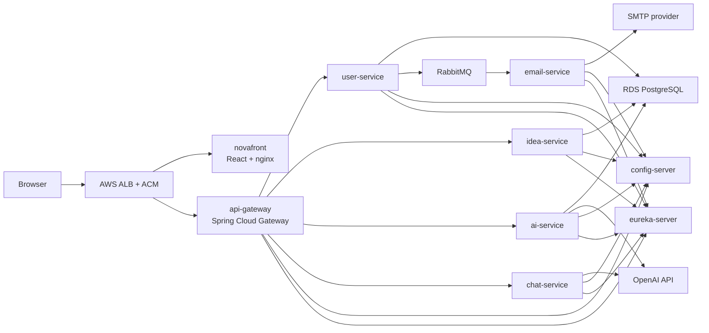

# Architecture

NovaFlow is a multi-service planning application. The frontend talks to an API gateway, and the gateway routes requests to smaller Spring Boot services that each own a specific part of the system.

## Runtime Overview

## Services

| Module | Responsibility | Main runtime dependency |
| --- | --- | --- |
| `novafront` | React user interface served by nginx | API gateway |
| `api-gateway` | Public backend entry point and request routing | Eureka, config server |
| `user-service` | Users, login, JWT, Google OAuth, activation, password reset | PostgreSQL, RabbitMQ |
| `idea-service` | Idea and step persistence | PostgreSQL |
| `ai-service` | AI refinement/transcription integration | PostgreSQL, OpenAI |
| `chat-service` | Chat-style AI interaction | OpenAI |
| `email-service` | Consumes email notifications and sends SMTP mail | RabbitMQ, SMTP |
| `config-server` | Shared Spring configuration | Local config files in image |
| `common-config` | Shared config content used by Spring services | Config server |
| `notification-contracts` | Shared notification message contracts | User and email services |

## Important Flows

### Login And Account Activation

1. A user signs up manually or signs in with Google.
2. `user-service` creates or updates the local account.
3. If the account needs verification, `user-service` publishes an activation message to RabbitMQ.
4. `email-service` consumes the message and sends the activation email through SMTP.
5. The activation link returns through the public domain and enables the account.

### API Requests

1. Browser requests go to `https://novaflow.dotze.co.za`.
2. The ALB routes `/api/*`, `/oauth2/*`, and `/login/oauth2/*` to the API gateway.
3. Other paths route to the frontend.
4. The gateway routes backend requests to service instances discovered through Eureka.

### Production Deployment

1. GitHub Actions builds service images.
2. Images are pushed to ECR.
3. SSM Run Command updates the EC2 host without SSH.
4. ECS pulls images from ECR and keeps the desired tasks running.
5. ALB target groups route only to healthy targets.

## Local Vs Production

| Area | Local development | Production learning deployment |
| --- | --- | --- |
| Frontend | Vite dev server on port 3000 | ECS task running nginx |
| Backend services | Gradle bootRun or Docker Compose | ECS task on EC2 |
| Database | Docker PostgreSQL | RDS PostgreSQL |
| Message broker | Docker RabbitMQ | RabbitMQ container on EC2/ECS |
| Email | Mailpit by default | Real SMTP account |
| Secrets | `.env` and `builder/.env` | SSM Parameter Store |
| Logs | Terminal and Docker logs | CloudWatch Logs |

## Design Choices

- The API gateway is the only public backend surface.
- Each service keeps its own database boundary where practical.
- RabbitMQ decouples account events from SMTP delivery.
- ECR is the image store; EC2 no longer needs to build production images.
- Parameter Store is the source of production secrets and runtime values.
- ECS owns container lifecycle, restart behavior, and rolling deployments.
