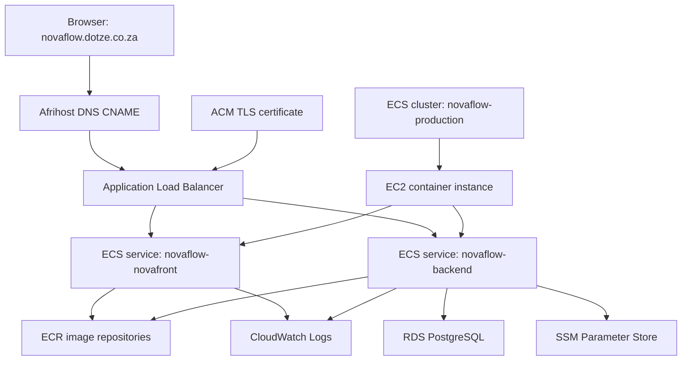
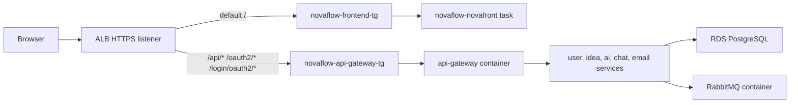
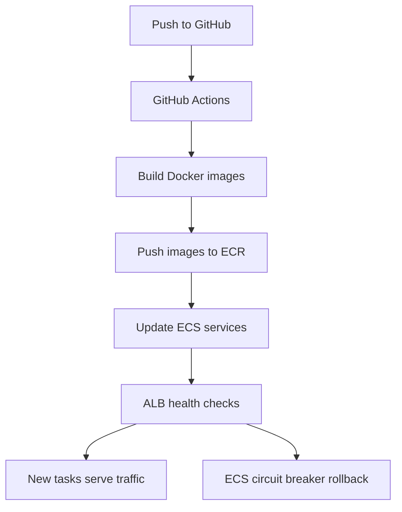

# NovaFlow AWS Recap And Teardown

Date documented: 2026-08-12

This document captures what was built during the NovaFlow AWS learning run,
why each AWS service mattered, and how to tear it down without leaving expensive
resources quietly running.

## Final Shape

NovaFlow moved from "one EC2 box running Docker Compose" to a small AWS-backed
production shape:

## What Each AWS Service Did

| Service | What it did for NovaFlow |
| --- | --- |
| EC2 | Supplied the actual CPU and memory where ECS runs containers. It is still the server, but no longer owns the whole deployment process by itself. |
| ALB | Became the public web entry point. It handles browser traffic and routes frontend paths to the frontend service, and API/OAuth paths to the backend gateway service. |
| ACM | Issued the HTTPS certificate for `novaflow.dotze.co.za`. The ALB uses this certificate so the app can serve HTTPS without managing certbot on the server. |
| SSM Session Manager and Run Command | Replaced public SSH as the main way to control EC2. GitHub can ask AWS to run deployment commands without opening SSH to the internet. |
| SSM Parameter Store | Holds production secrets and config values, replacing long-lived `.env` files on EC2. ECS injects those values into containers at runtime. |
| CloudWatch Logs | Receives container logs. This removed the need to SSH in and run `docker logs` for normal troubleshooting. |
| RDS PostgreSQL | Holds application databases outside EC2, so PostgreSQL no longer consumes EC2 memory, CPU, and disk. |
| ECR | Stores Docker images in AWS instead of GitHub Container Registry. GitHub Actions builds the images, pushes them to ECR, and ECS pulls from ECR. |
| ECS | Owns container startup, replacement, health checks, and rollback behavior for the frontend and backend services. |

## Current Request Flow

## Current Deployment Flow

Important caveat: older deployment scripts and documentation still exist because
they were used during the migration. If the GitHub workflow is still using
`builder/production-release/deploy-stack.sh`, then the source checkout on EC2 is
still needed. Once the workflow updates ECS task definitions directly and no
longer runs the Compose deploy script, EC2 does not need the full repository for
normal releases.

## Useful Resource Names

| Resource | Name |
| --- | --- |
| Domain | `novaflow.dotze.co.za` |
| AWS region | `us-east-1` |
| ECS cluster | `novaflow-production` |
| Frontend ECS service | `novaflow-novafront` |
| Backend ECS service | `novaflow-backend` |
| Frontend task family | `novaflow-novafront-ec2` |
| Backend task family | `novaflow-backend-ec2` |
| ALB | `novaflow-alb` |
| Frontend target group | `novaflow-frontend-tg` |
| API target group | `novaflow-api-gateway-tg` |
| RDS instance | `novaflow-postgres` |
| RDS endpoint | `novaflow-postgres.cmh8qyq0su15.us-east-1.rds.amazonaws.com` |
| ECR namespace | `novaflow` |
| CloudWatch log group | `/novaflow/production` |
| Production parameters | `/novaflow/production/env/*` |
| EC2 role | `NovaFlowEC2SSMRole` |
| ECS task execution role | `ecsTaskExecutionRole` |
| GitHub deploy role | `NovaFlowGithubActionsSsmDeploy` |

## What Costs Money While Idle

These are the resources to watch first:

| Resource | Why it still costs money |
| --- | --- |
| EC2 instance | Charges while running. EBS storage can still charge while stopped. |
| RDS instance | Charges while running. A stopped RDS instance can auto-start again after the AWS stop window. Snapshots still charge for storage. |
| ALB | Charges hourly while it exists, even with no user traffic. |
| Public IPv4 addresses | Public IPv4 addresses can charge while allocated or attached. |
| EBS volumes and snapshots | Storage charges remain after EC2 stops unless volumes/snapshots are deleted. |
| CloudWatch Logs | Stored logs can keep charging if retained forever. |
| ECR | Stored images can keep charging if repositories keep old images. |

ACM public certificates are normally free when used with supported AWS services,
but they are not useful after the ALB and domain are gone.

## Teardown Checklist

Use this order to avoid deleting dependencies while something is still attached.

### 1. Save Anything Worth Keeping

- Export or snapshot RDS if the data matters.
- Keep a copy of the final architecture notes and ECS task definition JSON.
- Export important CloudWatch logs if they are needed later.
- Keep Parameter Store names documented, but do not keep secrets if the project
  is being retired.

### 2. Stop Traffic

In Afrihost DNS:

- Remove or change the `novaflow.dotze.co.za` CNAME that points to the ALB.

In AWS ALB:

- Optional first step: change listeners to return a fixed `410 Gone` or
  maintenance response.
- Then delete the ALB when ready.

### 3. Stop ECS Workloads

In ECS:

- Set `novaflow-novafront` desired tasks to `0`.
- Set `novaflow-backend` desired tasks to `0`.
- Wait until there are no running tasks.
- Delete the ECS services if NovaFlow is not coming back soon.
- Deregister old task definition revisions if you want a cleaner account.

Why first: this stops containers from being recreated while you delete other
resources.

### 4. Delete The ALB And Target Groups

In EC2 Load Balancing:

- Delete `novaflow-alb`.
- Delete `novaflow-frontend-tg`.
- Delete `novaflow-api-gateway-tg`.

Why: the ALB has an hourly cost and public IPv4-related cost. Target groups do
not matter much for cost, but they are clutter once the ALB is gone.

### 5. Delete Or Stop RDS

If keeping data:

- Create a final snapshot.
- Confirm the snapshot exists.
- Delete the RDS instance and choose whether to keep the final snapshot.

If not keeping data:

- Delete `novaflow-postgres` with no final snapshot.

Do not rely on "stop RDS" as a long-term cost saver. It is temporary. For a
project you do not plan to keep live, deleting RDS is the clean answer.

### 6. Stop Or Terminate EC2

If keeping the server for future learning:

- Stop the EC2 instance.
- Review attached EBS volumes.

If tearing down fully:

- Terminate the EC2 instance.
- Confirm whether the root EBS volume is set to delete on termination.
- Delete any remaining unattached EBS volumes.
- Release any Elastic IP that is not attached and needed.

### 7. Clean ECR

In ECR:

- Delete repositories under `novaflow/*`, or delete old images and keep only a
  tiny reference set.

For a full teardown, delete:

- `novaflow/config-server`
- `novaflow/user-service`
- `novaflow/idea-service`
- `novaflow/ai-service`
- `novaflow/chat-service`
- `novaflow/email-service`
- `novaflow/api-gateway`
- `novaflow/novafront`

### 8. Clean CloudWatch

In CloudWatch Logs:

- Delete `/novaflow/production`, or set a short retention period first.
- Remove any alarms created for ECS, ALB, RDS, or EC2 if they are not needed.

### 9. Clean Parameter Store

In Systems Manager Parameter Store:

- Delete parameters under `/novaflow/production/env/`.
- Delete older one-off parameters such as `/novaflow/production/ghcr/*` if they
  still exist.

This is mostly cleanup and secret hygiene, not the biggest cost item.

### 10. Clean IAM

Delete these only after the services that use them are gone:

- `NovaFlowEC2SSMRole`
- `ecsTaskExecutionRole`
- `NovaFlowGithubActionsSsmDeploy`
- GitHub OIDC provider, if it is only used by NovaFlow
- Inline policies created only for NovaFlow

IAM itself is not the cost problem, but unused permissions are future confusion.

### 11. Clean Security Groups

After EC2, ALB, RDS, and ECS are deleted:

- Delete `novaflow-alb-public`
- Delete `novaflow-ec2-from-alb`
- Delete the RDS security group created for NovaFlow
- Leave the default security group alone unless you know nothing else uses it.

AWS will block deletion if a security group is still attached somewhere.

### 12. Verify Billing Is Quiet

After teardown, check:

- AWS Billing and Cost Management
- Cost Explorer
- EC2 instances
- EC2 volumes
- EC2 elastic IPs
- Load balancers
- Target groups
- RDS databases
- RDS snapshots
- ECR repositories
- CloudWatch log groups
- NAT Gateways, if any were ever created

NAT Gateways are especially important in AWS accounts generally because they can
burn money while forgotten. NovaFlow did not need one during this migration.

## Safe Dormant Mode

If the goal is "pause, but maybe resume later", use this instead of deleting
everything:

1. Set ECS services desired tasks to `0`.
2. Delete the ALB.
3. Stop EC2.
4. Snapshot and delete RDS, or accept the RDS cost if you keep it running.
5. Set CloudWatch log retention to a short period.
6. Keep ECR images only if you want fast restoration.

This preserves most of the learning path, but it is not free. The main recurring
costs become whatever storage, snapshots, public IPv4 resources, ECR images, and
RDS choices remain.

## What To Rebuild Next Time

If NovaFlow is rebuilt later, the cleaner next version should be:

- Infrastructure as Code first, probably Terraform or AWS CDK.
- ECS deployments directly from GitHub Actions, with no source checkout needed
  on EC2.
- One task definition template per ECS service, rendered with the new ECR image
  tag during CI.
- RDS kept outside EC2 from the start.
- Parameter Store or Secrets Manager used from day one.
- CloudWatch log retention set immediately.
- AWS Budgets alarm created before any paid resources are launched.

## Lessons Learned

- AWS services are not magic replacements. Each one takes over one job from the
  old server.
- ALB took over public routing and TLS from nginx and certbot.
- SSM took over remote server access from SSH.
- Parameter Store took over `.env` files for production secrets.
- ECR took over image storage from GitHub Container Registry.
- RDS took over PostgreSQL from the EC2 Docker host.
- ECS took over container scheduling from Docker Compose.
- CloudWatch took over day-to-day log viewing from `docker logs`.
- EC2 still mattered until Fargate or more ECS capacity replaced it.

The big win was learning the shape of a real AWS deployment. The big warning is
that real AWS deployments have real monthly floors, even when nobody uses the
app.
