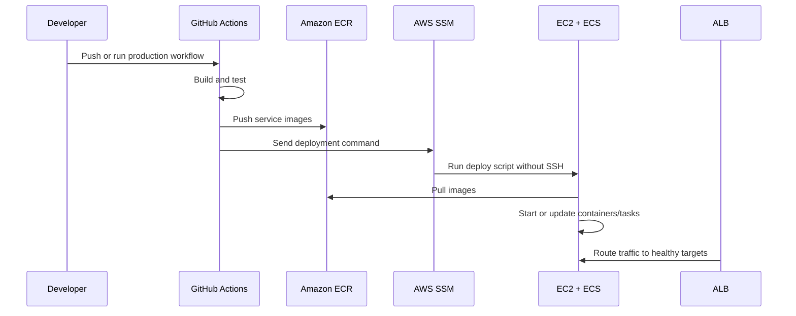

# Deployment

NovaFlow production deployment now uses AWS for image storage, configuration, and remote execution. The goal is to avoid building on EC2 and avoid public SSH-based deployments.

## Production Flow



## Main AWS Resources

| Resource | Purpose |
| --- | --- |
| ALB | Public HTTP/HTTPS entry point and path routing |
| ACM | TLS certificate for `novaflow.dotze.co.za` |
| EC2 | Compute host for ECS tasks |
| ECS | Keeps frontend and backend containers running |
| ECR | Stores production Docker images |
| RDS | PostgreSQL databases |
| SSM Run Command | Runs deploy commands without SSH |
| SSM Parameter Store | Stores secrets and runtime config |
| CloudWatch Logs | Central application logs |

## GitHub Actions

The production workflow is:

```text
.github/workflows/production-deploy.yml
```

It does four important things:

1. Builds service images.
2. Pushes images to ECR.
3. Uses GitHub OIDC to assume an AWS deploy role.
4. Uses SSM Run Command to run the production deploy script on EC2.

Required GitHub repository variables/secrets include:

| Name | Purpose |
| --- | --- |
| `PRODUCTION_AWS_ROLE_ARN` | IAM role GitHub Actions assumes through OIDC |
| `PRODUCTION_AWS_REGION` | AWS region, currently `us-east-1` |
| `PRODUCTION_SSM_INSTANCE_ID` | EC2 instance id |
| `PRODUCTION_DEPLOY_PATH` | App path on EC2 |
| `PRODUCTION_DEPLOY_USER` | Linux user, usually `ubuntu` |
| `PRODUCTION_ECR_NAMESPACE` | ECR namespace prefix, usually `novaflow` |
| `PRODUCTION_SSM_ENV_PATH` | Parameter Store path, usually `/novaflow/production/env` |

## ECR Naming

Images are pushed under the ECR namespace:

```text
<account>.dkr.ecr.us-east-1.amazonaws.com/novaflow/<service>:<tag>
```

Example:

```text
270023013144.dkr.ecr.us-east-1.amazonaws.com/novaflow/api-gateway:a170b0197787
```

The namespace comes from `PRODUCTION_ECR_NAMESPACE`. If it changes, IAM policies and task definitions must allow the new repository path.

## SSM Deployment

The workflow sends an `AWS-RunShellScript` command to EC2. The command:

1. Checks out the target Git commit.
2. Logs Docker into ECR.
3. Reads production environment values from Parameter Store.
4. Runs the production deploy script with the image tag created by CI.

This replaces SSH deployment. SSH can remain as a break-glass path, but it is no longer the normal release mechanism.

## ECS Deployment State

ECS is responsible for keeping the frontend and backend tasks alive. It restarts failed tasks and works with ALB target groups so traffic goes to healthy targets.

The ECS templates and notes live in:

```text
builder/ecs/
```

Important files:

| File | Purpose |
| --- | --- |
| `novafront-task-definition.ec2.json` | Frontend ECS task definition |
| `novafront-service.ec2.json` | Frontend ECS service template |
| `novaflow-backend-task-definition.ec2.json` | Backend ECS task definition |
| `novaflow-backend-service.ec2.json` | Backend ECS service template |

When task definitions use an image tag placeholder, replace it with the exact ECR tag before registering a new revision.

## RDS Migration

The migration script moves data from the old Docker PostgreSQL container to RDS:

```bash
SSM_ENV_PATH=/novaflow/production/env SSM_ENV_REGION=us-east-1 sh builder/production-release/migrate-postgres-to-rds.sh --yes
```

After a successful migration, the local PostgreSQL container is no longer needed for production.

## Rollback

Rollback options depend on where the failure happened:

| Failure point | Rollback |
| --- | --- |
| GitHub build fails | No production change happened |
| Image push fails | Re-run after the registry issue clears |
| SSM command fails before deployment | Fix command/config and re-run |
| ECS task fails health checks | ECS can roll back to the previous service revision |
| Bad app behavior after deploy | Register/update ECS service with previous known-good image tag |

Keep previous ECR image tags long enough to make rollback possible.
